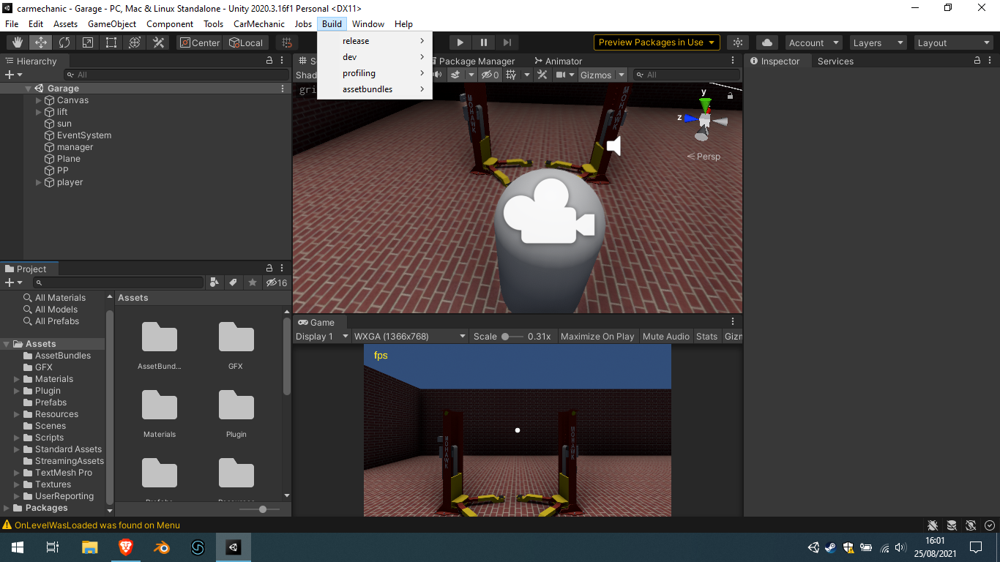
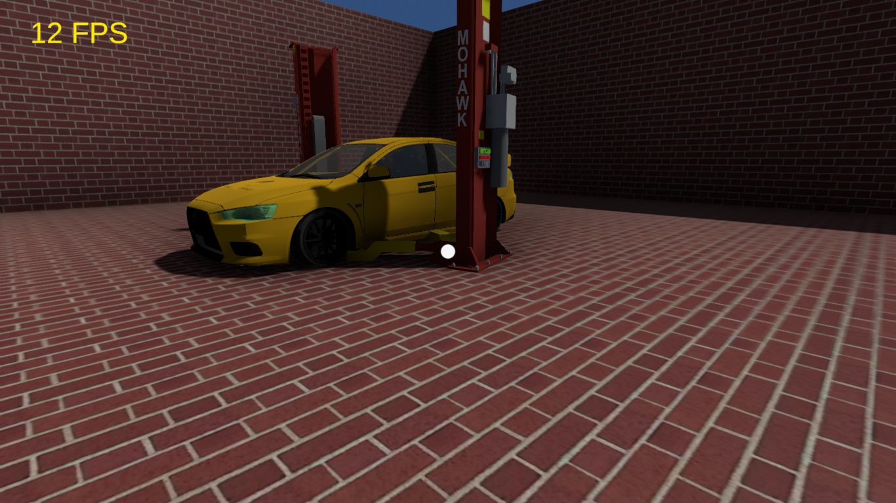
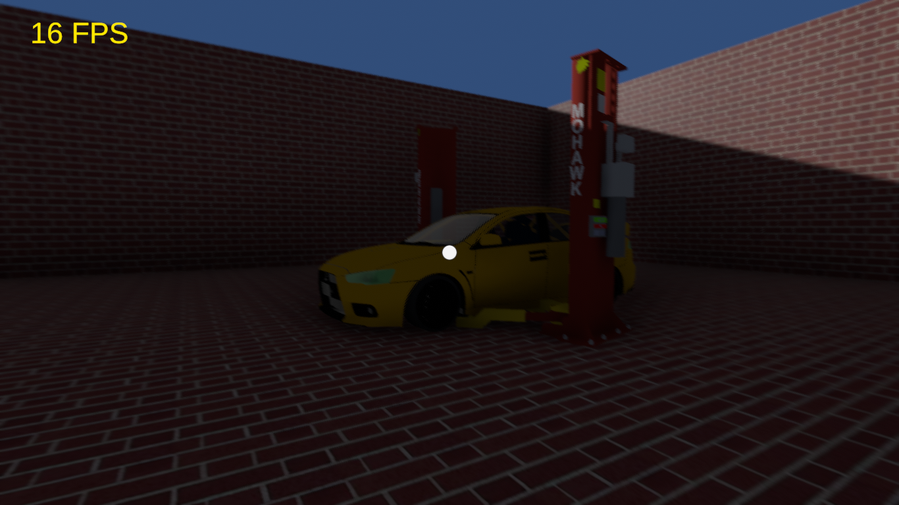

===========
carmechanic
===========

About the game
--------------

CarMechanic is an open source car mechanic simulator that allows you to disassembly/assembly cars.
This game is NOT finished as i would need a full car (including the engine) model to finish the game core.

Adding a new vehicle
--------------------

Notice:

- You will need Unity.
- Valid model formats: fbx or collada (.dae).
- Car parts can't have childs, so each part must be a single solid.
1. Open /StreamingAssets/vehicles.json and add a new entry for your vehicle: { name: "Lancer Evolution", folder: "LANCER-E" }
2. Create the folder in /StreamingAssets/ having the same name you set in vehicles.json. Ex: /StreamingAssets/LANCER-E/
3. Drop your car model there.
4. Open CarSimulator project in Unity & open Garage scene (double click on /Scenes/Garage).
5. In the bottom window, search for your model file and click it. Unity's Inspector window will display model's options. Check the "Generate Colliders" & click on Apply button.
6. drop your model from /StreamingAssets/YOU_MODEL/ to the scene. If you don't see it. Clic it in Hierarchy window and reset his position in Inspector to: 0,0,0.
7. You model may look bigger or smaller than expected. To fix this, you can change the model scale in Inspector window.

Now that your car is ready, you will have to set each part. This example will be done with the car doors:

1. Double click one of the doors and attach the "CarPart" component to it. You will see some new options like "Type" && "Disassembly Requirements". Select which door is in Type section.
2. Since it's a door player should disassembly the window before disassembling the door itself. To do that, drag the window label from Hierarchy Window to "Disassembly Requirements" list. Now disassembling the window will be required to disassembly the door. Do not touch "Assembly Requirments", we will autogenerated this list now.
If your car part is not listed in "Type" selector. Open /Scripts/Engine/CarEngine.cs and list it in "Part" enumerator. (To become able to share your model, you will need to make a pull request with this change here).
3. Once you have attached the "CarPart" component to all parts, click on "CarMechanic" option from Toolbar and click "Apply carPart tag" and then "Generate assembly requirements".
4. In Hierarchy window, rename your car label to "Vehicle" and drag it to /StreamingAssets/YOU_MODEL/.

You're done! Your car will appear in vehicles list.
If you want to share your vehicle, send the /StreamingAssets/YOU_MODEL/ folder and the vehicles.json entry data.

------------------------------

===========================
simplified compile workflow
===========================

===============
day/night cycle
===============

day
---

night
-----
  

=======
credits
=======

1. Engine Model: Source: http://www.3dvia.com/models/4B9A204153657749/engine-room-3d 

creator: jdillon

2. Outline shaders: http://wiki.unity3d.com/index.php/Outlined_Diffuse_3
3. Orbit camera code base: http://www.lucedigitale.com/blog/unity-3d-game-engine-camera-mouse-orbit/
4. Catch hand cursor: Source: http://findicons.com/icon/267861/cursor_drag_hand

creator: http://Gentleface.com

5. Mitsubishi Lancer Evolution X: URL: http://tf3dm.com/3d-model/mitsubishi-lancer-evolution-x-98027.html

creator: silviuq12

6. Car lift model: URL: https://3dwarehouse.sketchup.com/model.html?id=b30edc79010f1ea178fe949fc1419876

creator: pixelmonkey 3.

7. Car lift sound effect: URL: https://www.youtube.com/watch?v=cXqDc6I1NP8

creator: SoundEffectsFactory

8. Car lift button model: URL: https://3dwarehouse.sketchup.com/model.html?id=bcd36619f9dfae1b853bf916f291fa0f 

creator: Joe T.